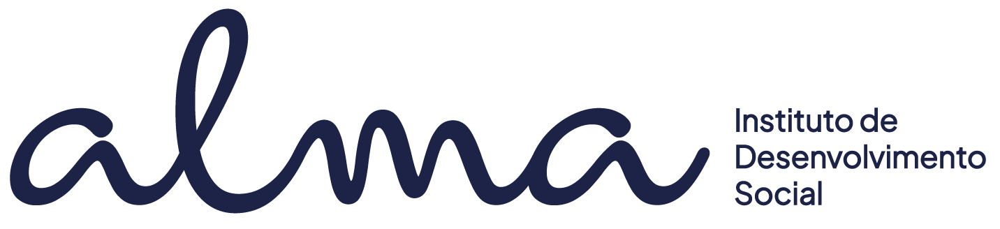

# FECAP - Fundação de Comércio Álvares Penteado

# Instituto Alma

## DevMasters

## Integrantes: <a href="http://www.linkedin.com/in/matheusfernandes2005">Matheus Fernandes Moraes</a>, <a href="linkedin.com/in/henri-seixas">Henri Seixas Souza</a>, <a href="LINK DO LINKEDIN">Ana Luiza Ribeiro do Vale</a>, <a href="https://www.linkedin.com/in/pedro-henrique-ara%C3%BAjo-del-picolo-aa9444276?utm_source=share&utm_campaign=share_via&utm_content=profile&utm_medium=ios_ap">Pedro Henrique Araujo Del Picolo</a>

## Professores Orientadores: <a href="https://www.linkedin.com/in/francisco-escobar/">Francisco de Souza Escobar</a>, <a href="https://www.linkedin.com/in/victorbarq/">Victor Bruno Alexander Rosetti de Quiroz</a>, <a href="https://www.linkedin.com/in/eduardo-savino-gomes-77833a10/">Eduardo Savino Gomes</a>, <a href="https://www.linkedin.com/in/ronaldo-araujo-pinto-3542811a/">Ronaldo Araujo Pinto</a>, <a href="https://www.linkedin.com/in/jbuesso/">José Carlos Buesso Jr</a>

## Descrição

##

Site responsivo para a ONG Instituto Alma, focado em divulgar ações, projetos e formas de doação.
Inclui carrossel de destaques, páginas “Sobre Nós”, “Projetos”, “Como Ajudar” e “Contato”, além de área administrativa.
Stack principal: React (Vite) no front e API Node/Express com MySQL.
Objetivo: transparência, engajamento e captação de recursos para ampliar o impacto social.

## 🛠 Estrutura de pastas

-Raiz 
| 
|-->documentos 
  &emsp;|-->Entrega 1 
  &emsp;&emsp;|-->Banco de Dados 
  &emsp;&emsp;|-->Desenvolvimento Web Full Stack 
  &emsp;&emsp;|-->Design de Interface Digital 
  &emsp;&emsp;|-->Estrutura de Dados 
  &emsp;&emsp;|-->Programação Orientada a Objetos 
  &emsp;|-->ReadME 
  &emsp;|Documentação.docx 
|-->src 
  &emsp;|-->Entrega 1 
  &emsp;&emsp;|-->Front-End 
  &emsp;&emsp;|-->Back-End 
  &emsp;|-->Entrega 2 
  &emsp;&emsp;|-->Front-End 
  &emsp;&emsp;|-->Back-End 
|-->imagens 
|readme.md 

## 🎓 Referências

Aqui estão as referências usadas no projeto.

1. <https://github.com/iuricode/readme-template>
2. <https://github.com/gabrieldejesus/readme-model>
3. <https://chooser-beta.creativecommons.org/>
5. <https://www.toptal.com/developers/gitignore>
